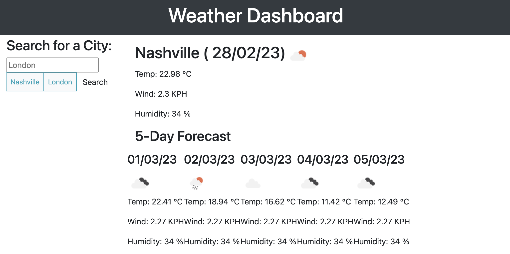

# weather-dashboard

## Description 

AS A traveler
I WANT to see the weather outlook for multiple cities
SO THAT I can plan a trip accordingly

When a user searches for a city they are presented with current and future conditions for that city and that city is added to the search history. When a user views the current weather conditions for that city they are presented with information. When a user views future weather conditions for that city they are presented with a 5-day forecast. When a user clicks on a city in the search history they are again presented with current and future conditions for that city.

## Screenshot

## Link
https://sophiedodsworth.github.io/weather-dashboard/

## License 
MIT license